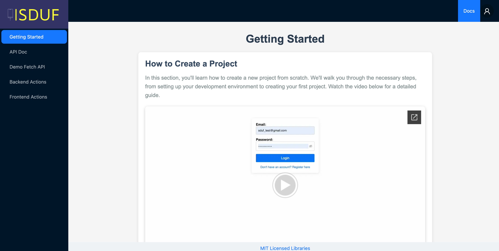
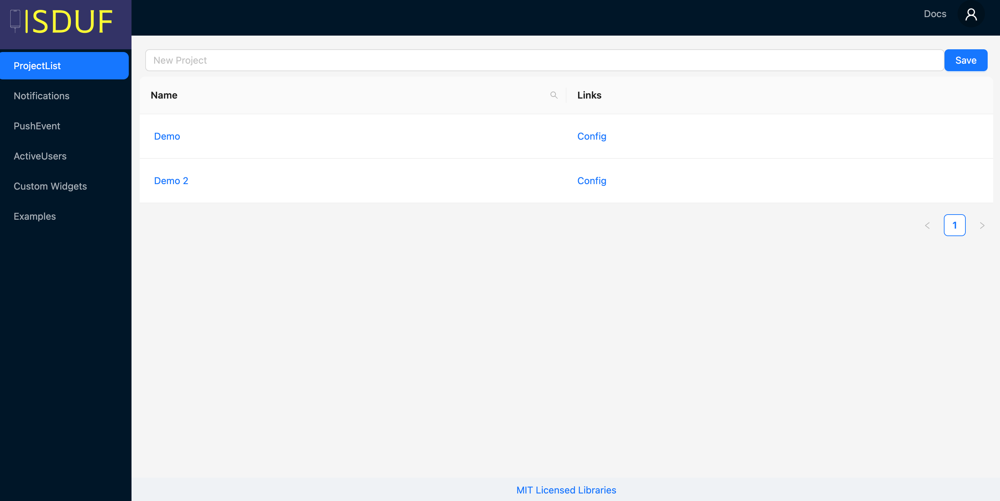
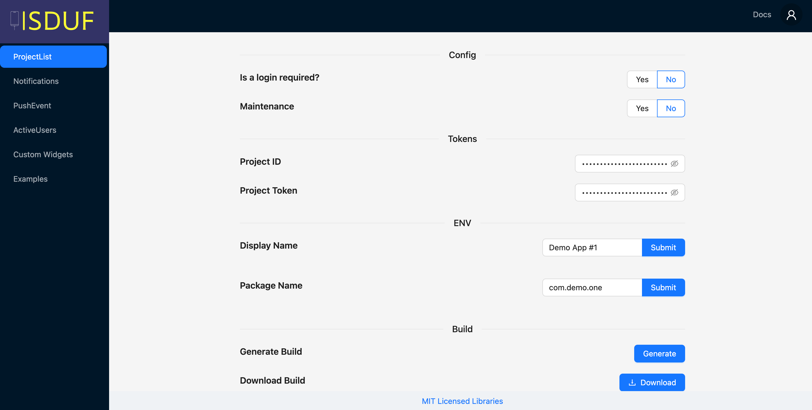
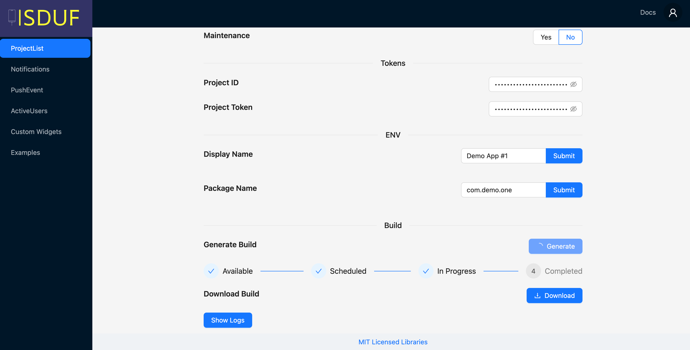
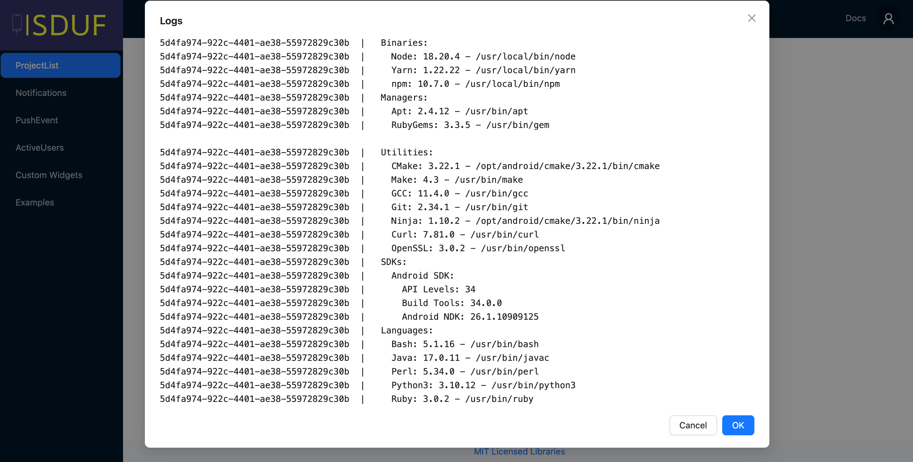
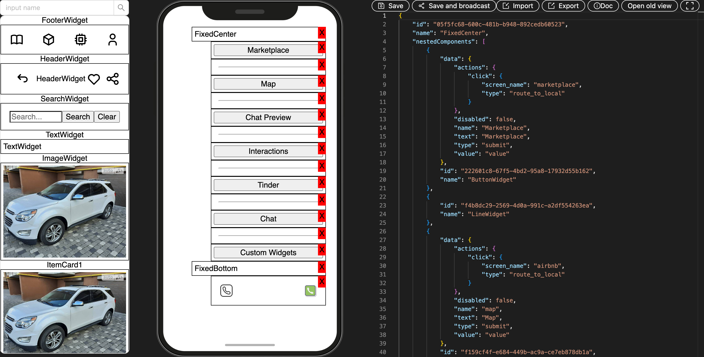
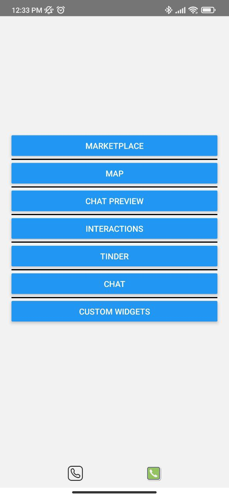

# SDUF React Native Application

Mobile Server-Driven UI Application This project is a mobile application that leverages server-driven UI principles, allowing users to configure and display screens dynamically through a web panel. By decoupling the user interface from the application logic, the app provides flexibility and adaptability

<p align="center">
   
   
   
   
   
   
   
</p>

This repository contains the SDUF React Native application. Follow the instructions below to set up and run the project.

## Installation

1. Set Up Your Environment

[Doc here](https://reactnative.dev/docs/next/set-up-your-environment)

2. Clone the repository:

   ```sh
   git clone git@github.com:Dimakoua/sdufReactNative.git
   ```

3. Navigate to the project directory:

   ```sh
   cd sdufReactNative
   ```

4. Install the dependencies:
   ```sh
   npm install
   ```

## Configuration

1. Register an account [here](http://144.126.138.185).

2. Create a new project on the registration platform.

3. Edit the \`.env\` file in the project directory with the project ID and token you received after creating the project.

4. In order to use maps, register and get an API key from [Maptiler](https://www.maptiler.com/)

5. Inside the project, you can create a screen. **Note:** An 'index' screen is mandatory.

6. Open a screen and use the drag and drop feature available on the platform to set up one.

## Running the Application Android

To run the application on an Android device or emulator, execute the following command:

```sh
npx react-native run-android
```

```sh
npx react-native start --reset-cache
```

## Running the Application IOS (WIP)

To run the application on an Android device or emulator, execute the following command:

```sh
cd ios && NO_FLIPPER=1 pod install
```

From root dir
```sh
npm run ios 
```

## Prettier

format all files with Prettier:

```sh
npm run prettierFixAll
```

More details [here](https://prettier.io/docs/en/install)

## Notes

- This application currently supports only Android devices.
- This is the initial version of the application.

Enjoy!
